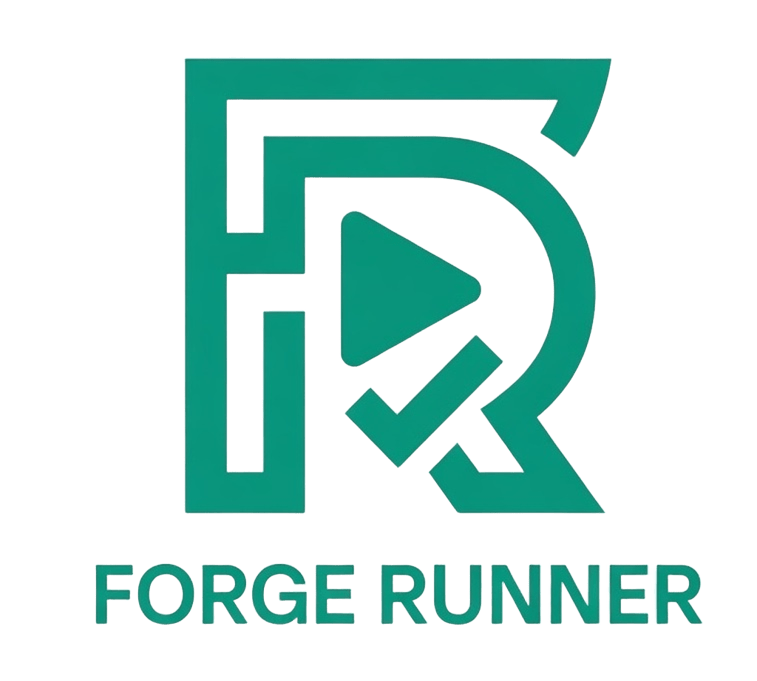

  

# 🚀 Forge Runner: Onboarding & Setup Guide

Welcome! Setting up Forge Runner takes less than two minutes. This guide will help you connect your AI models and boot up your local MCP server.

---

## Step 1: Install the Extension

If you haven't already, install the `.vsix` package:
1. Open the VS Code Extensions panel (`Ctrl+Shift+X`).
2. Click the `...` menu in the top right.
3. Select **"Install from VSIX..."** and choose `forge-runner-2.0.0-rc.9.vsix`.

## Step 2: Configure Your AI Provider

Forge Runner relies on Large Language Models to generate code and self-heal your tests. We support two primary interfaces.

### Option A: The "Zero-Config" Route (GitHub Copilot)
If your organization already pays for GitHub Copilot, you get instant, free access to GPT-4o, Claude 3.5 Sonnet, and Gemini Pro directly inside Forge Runner!

1. Install the **GitHub Copilot Chat** extension in VS Code.
2. Ensure you are signed into GitHub.
3. Forge Runner will automatically detect `vscode-lm` and bind to it. You are done!

### Option B: The "Bring Your Own Key" Route (Anthropic)
If you prefer not to use Copilot and want to hit Claude directly:

1. Open VS Code Settings (`Ctrl+,`).
2. Search for `forge-runner.ai.provider`.
3. Change the dropdown from `vscode-lm` to `anthropic`.
4. Search for `forge-runner.ai.anthropicApiKey` and paste your `sk-ant-api...` string.

## Step 3: Connect the MCP Engine

Forge Runner executes all its heavy AI scraping and DOM inspection out-of-process using a local daemon called the **Model Context Protocol (MCP)**. 

By default, the extension automatically looks for `npx playwright-bdd-pom-mcp` or attempts to sniff out your global `claude_desktop_config.json` standard paths. 

If the status bar says **`$(plug) MCP: Connected`**, you are good to go!

If the status bar is red and says **`$(error) MCP: Disconnected`**, follow these steps:
1. Open your terminal.
2. Run `npm install -g @rohit/playwright-bdd-pom-mcp` (or your internal package name).
3. Open VS Code Settings (`Ctrl+,`).
4. Search for `forge-runner.ai.mcpServerPath` and provide the absolute path to your global `node_modules/.../dist/index.js` file.
5. Click the Red Error icon in the status bar (or run `Forge: Reconnect MCP Server` from the command palette) to reboot the bridge.

## Step 4: Run Your First Test!

1. Open the flask icon (🧪) Testing View on the left.
2. Create a file called `tests/first.feature`.
3. Give it a simple scenario.
4. Click the `▶ Run` CodeLens right above your text!

You are now a Forge Power User! 🚀
